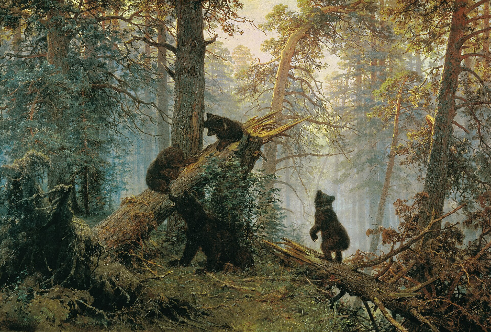

<h1 align="center">Math Woods</h1>

<p align="center">
  <strong>The Free Math Knowledge Graph.</strong><br>
  An open-source, community-curated collection of mathematical problems, concepts, and more.
</p>

<p align="center">
  <a href="https://mathwoods.org"><strong>Visit Math Woods</strong></a>
  &nbsp;·&nbsp;
  <a href="./CONTRIBUTING.md">Contribute</a>
  &nbsp;·&nbsp;
  <a href="./LICENSING.md">Licensing</a>
</p>



> [!IMPORTANT]
> The software is available under [AGPL-3.0-or-later](./LICENSE). Public educational content is available under
> [CC BY-NC-SA 4.0](./CONTENT_LICENSE.md) unless a page states otherwise. The Math Woods name and official visual
> identity are governed by the [Brand Policy](./TRADEMARK.md). The complete overview is in
> [LICENSING.md](./LICENSING.md).

## About Math Woods

Math Woods is a place for solving and sharing mathematical problems. Problems are linked to an evolving wiki-style encyclopedia of concepts with practice exercises. The chat system allows users to communicate and study together.

Because it is open-source, anyone can help improve the code and the content of the website.

## Running Math Woods locally

Math Woods uses Node.js 22 and PostgreSQL. Install [Node.js 22](https://nodejs.org/) and
[Docker Desktop](https://www.docker.com/products/docker-desktop/) before starting. Docker only runs the local database;
the Next.js application runs through Node.js on your computer.

Clone your fork (or the main repository), then run the following commands from the cloned `math-woods` directory:

```bash
git clone https://github.com/YOUR-USERNAME/math-woods.git
cd math-woods
cp .env.example .env
npm install
docker compose up -d postgres
npm run local:setup
npm run dev
```

Open [http://localhost:3000](http://localhost:3000). The local demo account is:

```text
Username: curator
Email: curator@example.com
Password: curator-demo
```

Either the username or the email can be used on the login page. If this account does not work, run
`npm run db:seed` again and check that the command ends with `Demo data ready`. This recreates the account when it is
missing and resets its local password to `curator-demo`.

On Windows, use `npm.cmd` instead of `npm` if PowerShell prevents the wrapper from running. After the initial setup,
`powershell -ExecutionPolicy Bypass -File scripts/launch-dev.ps1` can start PostgreSQL and the development server for
subsequent sessions.

External login providers, email delivery, Redis-compatible rate limiting, and object storage are optional during local
development. Their environment variables are documented in [`.env.example`](./.env.example). Never commit a real
`.env` or `.env.production` file.

## Development

The application is built with Next.js 15, React 19, TypeScript, Prisma, and PostgreSQL. CodeMirror powers the
Markdown/LaTeX editor, KaTeX renders mathematics, JSXGraph supports interactive figures, and React Flow powers the
exploration canvas. Production runs in Docker with Caddy, Valkey, and automated PostgreSQL backups.

Before opening a pull request, run the same checks used for substantial local changes:

```bash
npx tsc --noEmit
npm run test:core
npm run build
```

The editor has a history of delicate edge cases around live LaTeX, selections, links, lists, and display mathematics.
Please read [`docs/editor-regressions.md`](./docs/editor-regressions.md) before changing it. The production setup is
documented separately in [`deploy/INFOMANIAK.md`](./deploy/INFOMANIAK.md).

## Contributing

There are many useful ways to take part: write or translate mathematical content, improve a proof, review a page, report
a bug, refine the interface, or contribute code. The site records authorship and revision history so that changes can be
discussed and understood.

Please read [`CONTRIBUTING.md`](./CONTRIBUTING.md) before submitting work. Only contribute material you wrote, material
in the public domain, or material you have permission to publish under the relevant Math Woods license. Sources and
adaptations should be identified clearly.

Math Woods was developed with assistance from AI coding tools under human direction and review. Responsibility for
the published project remains human.

## Licensing and credits

The application code is licensed under the [GNU Affero General Public License v3.0 or later](./LICENSE). Educational
content uses [CC BY-NC-SA 4.0](./CONTENT_LICENSE.md) by default. Forks should use their own name and visual identity in
accordance with the [Brand Policy](./TRADEMARK.md).

Forest paintings used by Math Woods are works by Ivan Shishkin (1832-1898), in the public domain. Default avatar
illustrations come from AsIan's *Animal Outlined Sepia Icons* collection under CC BY 4.0. Third-party notices and
attribution guidance are collected in [`NOTICE`](./NOTICE).
